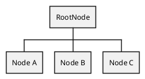
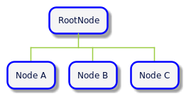
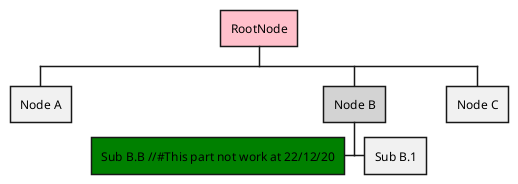
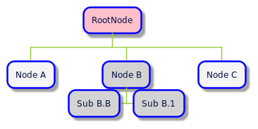

This package allow [WBS creation](https://plantuml.com/fr/wbs-diagram) 

# Getting started

## Install

```sh
composer req --dev pyrex-fwi/plantuml
```

### Sample usages

#### Sample 1

```php
#test-1.php

<?php
    //create document
    $wbs = new WorkBreakdownStructure('RootNode');
    
    //add subitems
    $wbs->addNode(new Node('Node A'));
    $wbs->addNode(new Node('Node B'));
    $wbs->addNode(new Node('Node C'));

    //get document as plantuml string
    echo $wbs->getDocumentContent();

```

```shell
php test-1.php > test-1.plantuml
```





[Show or edit on planttext](https://www.planttext.com/?text=ZL5BJyCm3BxdLrZY0XEYtOC3qeJsG8W38CIGTdORhusMEbAIQWoq_uxJLZrpIEBlyoEVxLM8wEEf24ejGpnRUbG2dWnM7XluLG1P1cWjMCCKuBeXPCCLb8wPokWy86iedDVamot4cZm1oc47Bg4XqJ3iDxkRpbLOB8zGd47J0LiRvPDN2IgTbN9N3qMf5rFXdXt7RS_by_omo8L3xzsfavM4fQm-el94tB69swL681_nLstAewW8CBsx5_QYv6AdQQYq4JsLTothljgfDf52uuxKkL-SDpyY1ktQceeRuWYM3d6itsSLjgL_I9Xr4W3Uq5SobVa0latJDdkZOpraVQ3MQTBJMGS_UtcUPQIpl6z2NTGo6xQc9XBYuhjqfIOJI2-iHsipMbkbLiHQblm7)

#### Sample 2

```php
#test-2.php

<?php
//create document
$wbs = new WorkBreakdownStructure('RootNode');

//add subitems
$nodes[] = new Node('Node A');
$nodes[] = new Node('Node B');
$nodes[] = new Node('Node C');

$nodes[1]
    ->addChild(new Node('Sub B.1'))
    ->addChild(
        (new Node('Sub B.B'))
            ->setToLeftPosition()
            ->setInlineColor('green')
    )
    ->setInlineColor('lightgray')
;

$wbs
    ->addChildrenNodes($nodes)
    ->getRootNode()
        ->setInlineColor('pink');

echo $wbs->getDocumentContent();


```

```shell
php test-2.php > test-2.plantuml
```





[Show or edit on planttext](https://www.planttext.com/?text=ZL8zJyCm4DtzAqxA0X5gaxOCI1LgKuGO026ArA7guCJNn8fpHewZKX3_dNCITMRmntk-UtvtzghrqlbJtWgnRFtPuBrWyA1bwMG3Fm9WEWLf31XDsC9LWv8qbL1O8YoyTI19GMwTGjVUWA_G8KWUPC46D2PgWbsslUwFSYEB6l8pA3pApdY-v9c32cjOBhhB2xL8cNkqv3S3byoJuo9XJZfdJxsjO2na3H6bGwIU3Tms50B91NzKkgZPHGlfv9RPNy4JMOMZKiP-IcSxKeFQgT8UsyRMs1y_MQU_sOmqQwDBQf0y63pwY_wGbPiE_s5Xrbi0U96kvAxCH_2bcwxPQUMhCUjDAXKwdSvw-3xOSyGjdIL34U9NBAVZgubu7trggWySQVqh5oVY6C8AQzxj8xPUUNxLys5WCsPZs7OvP9CqxFTHtyN3SYIpYy16Y1MIue_n1m00)


#### Useful links

* https://psalm.dev/
* https://phpqa.io/index.html
