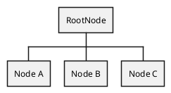
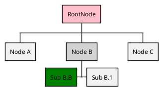

# Getting started

## Install

```sh
composer req --dev pyrex-fwi/plantuml
```


### Sample usages

#### Sample 1

```php
#test-1.php

<?php
    //create document
    $wbs = new WorkBreakdownStructure('RootNode');
    
    //add subitems
    $wbs->addNode(new Node('Node A'));
    $wbs->addNode(new Node('Node B'));
    $wbs->addNode(new Node('Node C'));

    //get document as plantuml string
    echo $wbs->getDocumentContent();

```

```shell
php test-1.php > test-1.plantuml
```




#### Sample 2

```php
#test-2.php

<?php
//create document
$wbs = new WorkBreakdownStructure('RootNode');

//add subitems
$nodes[] = new Node('Node A');
$nodes[] = new Node('Node B');
$nodes[] = new Node('Node C');

$nodes[1]
    ->addChild(new Node('Sub B.1'))
    ->addChild(
        (new Node('Sub B.B'))
            ->setToLeftPosition()
            ->setInlineColor('green')
    )
    ->setInlineColor('lightgray')
;

$wbs
    ->addChildrenNodes($nodes)
    ->getRootNode()
        ->setInlineColor('pink');

echo $wbs->getDocumentContent();


```

```shell
php test-2.php > test-2.plantuml
```




#### Useful links

* https://psalm.dev/
* https://phpqa.io/index.html
